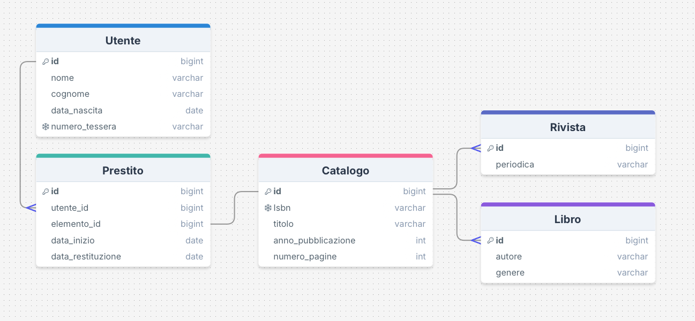
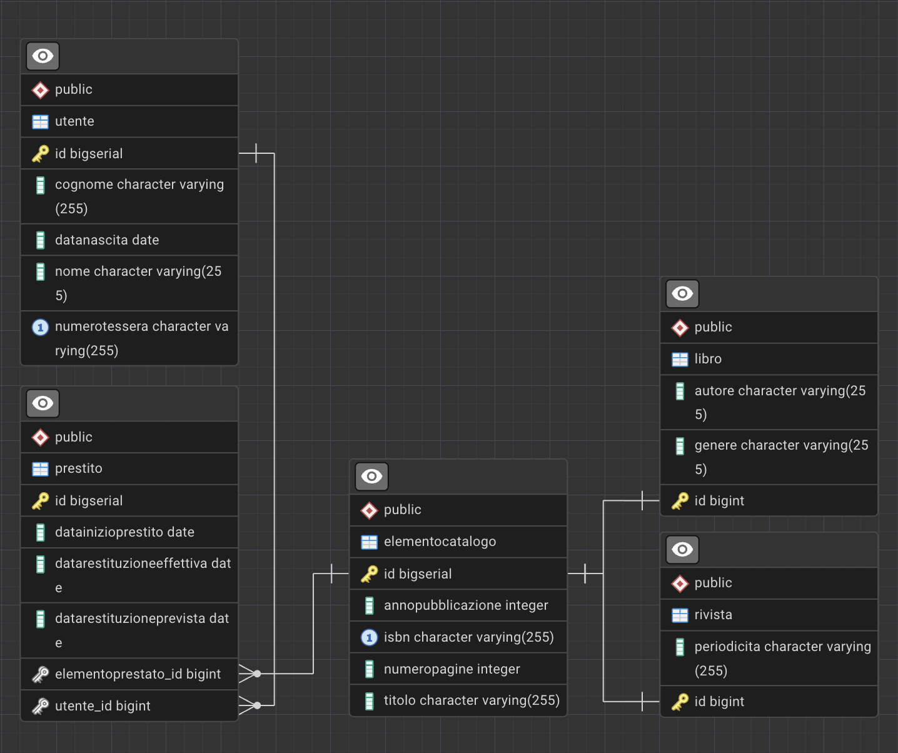

MODELLO ER

Ereditarietà JOINED: I dati comuni sono in Catalogo, mentre quelli specifici sono in Libro e Rivista, evitando colonne con valori nulli.

UNIQUE: ISBN e Numero Tessera.

Relazione Prestiti: ManyToOne verso Utente e Catalogo. Struttura polimorfica che permette di gestire il prestito di qualsiasi elemento del catalogo.

Logica Temporale: La data di restituzione prevista sarà calcolata automaticamente (30g).

